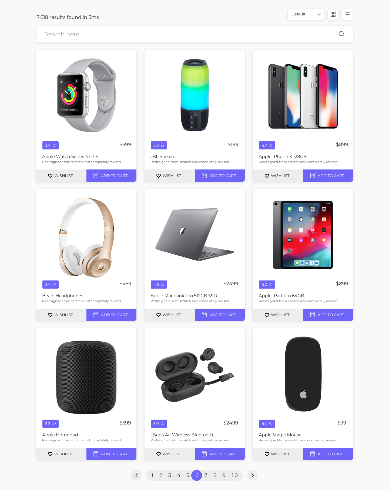
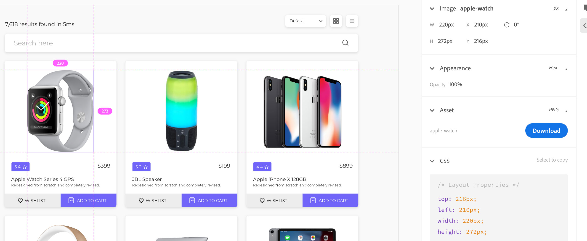

# UI Drive - TA Commerce
TA Digital Hacker Rank Test - A Simple e-Commerce Web site.

##BEFORE YOU START CODING, READ THIS PAGE FIRST

## General Guidelines:

*	On the machine - you already have development environment ready with following setup:
	* Visual Studio Code (including JS linting)
	* Gulp based workflow automation, includes hot reload on code changes
	* Required Scaffolding with inclusion of required JS, CSS, fonts etc.
*   **The solution must be completed within 120 minutes**
*   If you require any assistance or need any clarification, please call for it
*   **Use only Core JavaScript ES5 or 6**. Any other JS library or FRAMEWORK is NOT ALLOWED.
*   **NO CSS FRAMEWORK ALLOWED - only pure CSS**

## HTML + CSS
### READ IT CAREFULLY

* Create the design as per the mockup below.
* The product cards HTML have to be generated from the provided JSON (found here: 'data/products.json')
* Other required assets (scaffolding) are already linked or referred in the HTML document for you.
* Required fonts (from Google Fonts), and normalize css are already embedded in the HTML.
* Be creative and feel free to use any HTML templating if you want.

### Where are the images?
They are available in 'src/img' folder.

### Do we have Style specifications availble to match?
Browse this style specs. here: [https://xd.adobe.com/view/436434f7-0542-43c5-7134-9dbb3402f739-3555/](https://xd.adobe.com/view/436434f7-0542-43c5-7134-9dbb3402f739-3555/)

Click on any item, such as image, copy-text, button etc. to select it - and you would see the related style specifications in the right side:

####Don't try copy and use the CSS from XD specs. (it would waste your time) - just take a look at the specifications e.g. - height, width, font family, font size etc. and use those value in your CSS.

## JavaScript Functionalities
*   Include or load the product JSON data ('data/products.json') using AJAX/Fetch API.
*   Iterate through the products' and generate the product cards (as per the mockup).
*   User should be able to type a keyword e.g. product name in the Search bar (above) - this action should filter the products from JSON and show only the filtered result.
*   Allow users to click "Add to Cart" button and add the item into the cart.
*   Cart icon at the top should show the number of items added into it (No real Cart needs to be implement).
*   User can click multiple times for each product and the number at cart icon would keep increasing.
*   Each product JSON object has a key 'stock' - use this to apply a limit on maximum number of times an individual can be added into the cart. Example: if Apple watch stock is 5, user cannot add more than 5 watches in the cart.
*   If user reaches the stock limit, that product cart should show "Out of Stock" on the product card (as per mockup) - with a dimmed overlay, also clicking "Add to Cart" should be disabled.

#How to submit the code?
* Finish the code 5-10 minutes before the finish time.
* Zip the folder
* Upload it on HackerRank
